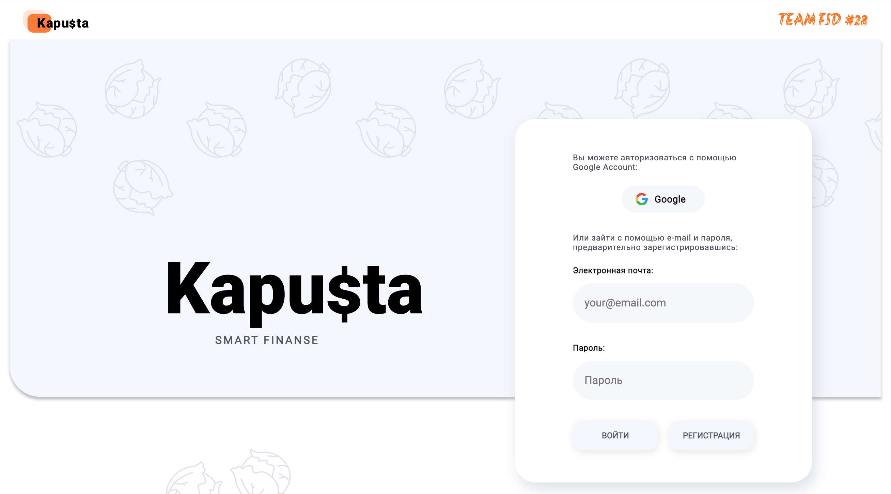

<!-- # ![][2] -->
# 

<h2 align="center"><a  href="https://finally-react-project.netlify.app/">Application page </a></h2>
<h2 align="center"><a  href="https://finally-node.herokuapp.com/api-docs/#/">API server</a></h2>

## Description

Graduation team project of students the FullStack developer course
.

<b>Frontend</b> is written on

with using
.

<b>Backend</b> is written on

with using
,
,

and

